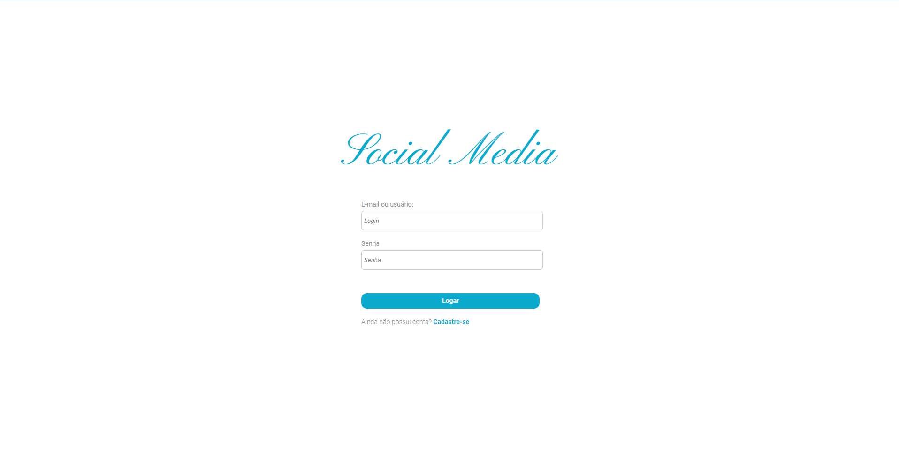
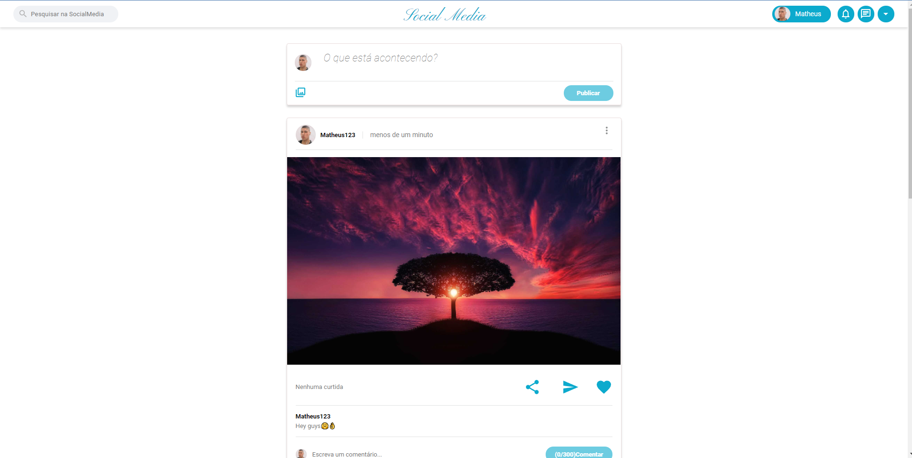
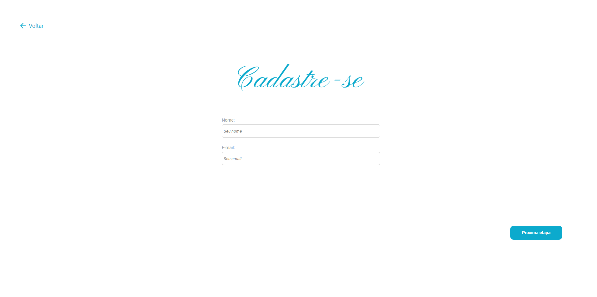
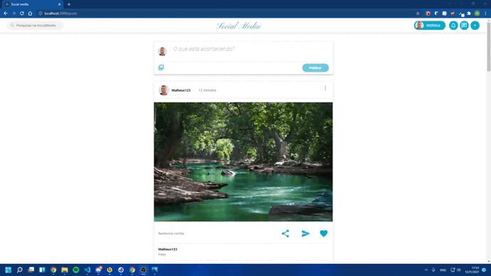
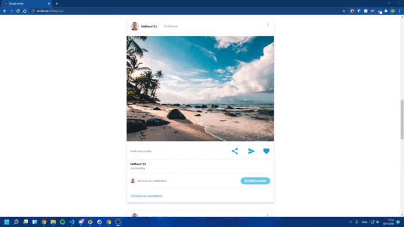

<h1 align="center">
 
  
 
 
Social media
</h1>

Uma rede social desenvolvida com React para o compartilhamento de fotos videos e mais(em desenvolvimento),
 <br/

# 📋 Índice

- [Telas](#-Telas)
- [Tecnologias utilizadas](#-Tecnologias-utilizadas)

## 🎨 Telas

<h4>Login: </h4>
 
<h4>Modelo de Post: </h4>
 
<h4>Cadastro: </h4>
   

## 🛠 Tecnologias utilizadas

- ⚛️ **React**
- ⚛️ **React redux**
- 🖼 **Axios**
- 💅 **Styled components** — Estilização dos componentes
